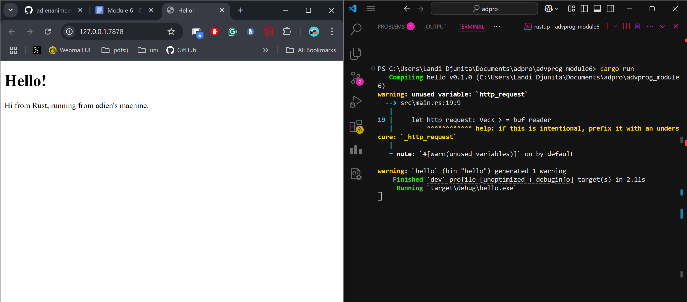
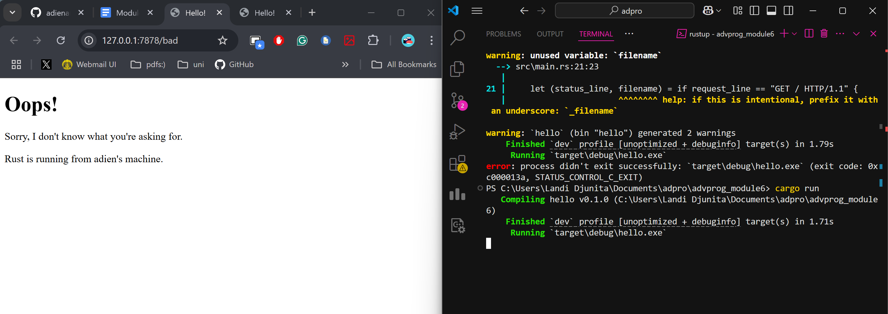
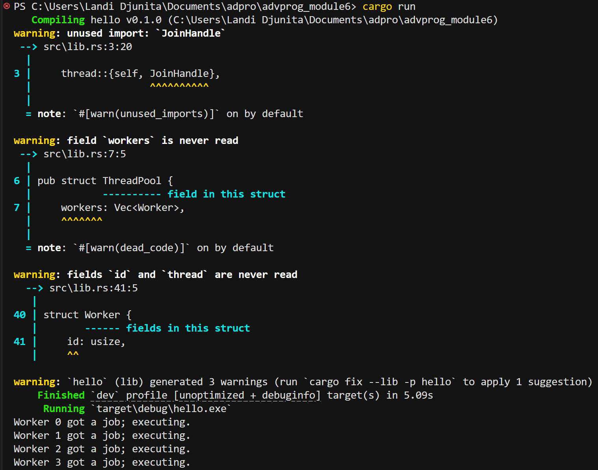

## Commit 1 Reflection
In this commit, the single-threaded HTTP server in rust is built by using only the `TcpListener` to 127.0.0.1:7878, then printing "Connection established!" whenever the browser is connected. I also used `.unwrap()` to skip over error checks just to get things working quickly, but it needs to be replaced with proper error handling before this could ever be reliable in a real application.

-----

## Commit 2 Reflection

In this commit, an HTML page is returned and this is done by reading a hello.html file and including its contents in the HTTP response. The `handle_connection` function is also changed to load the file and build the response string. Other than that, the browser won’t render anything unless it receives a properly formatted HTTP response. This includes headers like Content-Length so it knows exactly how many bytes to read.

-----

## Commit 3 Reflection

For this commit, the server respond differently depending on the request path. This is done by parsing the first line of the HTTP request, and then using "if" expression to return a proper “200 OK” page for the root path and a “404 NOT FOUND” page for other URLs. The duplicate response‑building code is removed and it makes it cleaner and easier to follow. This is done by checking if the request line equals `"GET / HTTP/1.1"` and using one tuple assignment for both the `status_line` and `filename`. Because of this, the server picks the correct HTTP status and HTML file.

-----

## Commit 4 Reflection
Adding a ten-second pause requests to `/sleep` froze the server completely, whereas the other browser tabs just load until the delay is finished. This shows that Rust handles requests one at a time, so a single slow request holds every other browser tabs up.

-----

## Commit 5 Reflection
In this commit, the single-threaded is updated to a multithreaded by building a custom ThreadPool. Instead of processing each connection sequentially, the server now spins up four worker threads that pull tasks from a shared channel, letting multiple requests run at the same time. The messages like “Worker 0 got a job; executing” in the terminal showed  slow requests no longer block the entire server. 


-----

## Bonus Reflection
For the bonus improvement, I modify the code so that it makes the threadpool safer and more explicit. This is done by replacing the panic-on-zero constructor with the code snipet below in `main.rs`.
```rust
let pool = ThreadPool::build(4)
```
Because of this, `build()` will return an error that the code can catch, instead of it crashing when a pool size is zero. Other than that, the original `new(size)` is kept as a simple wrapper around `build()` for backwards compatibility. Lastly, instead of using `assert!`, the pool‑size validation is moved into an `if` that returns a `Result`, and then changed `main.rs` so it explicitly unwraps or handles that error.